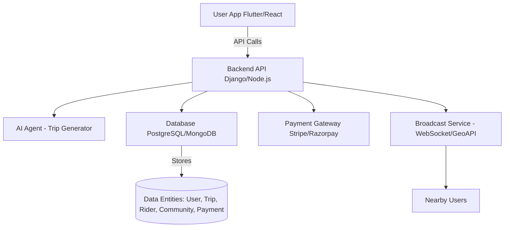
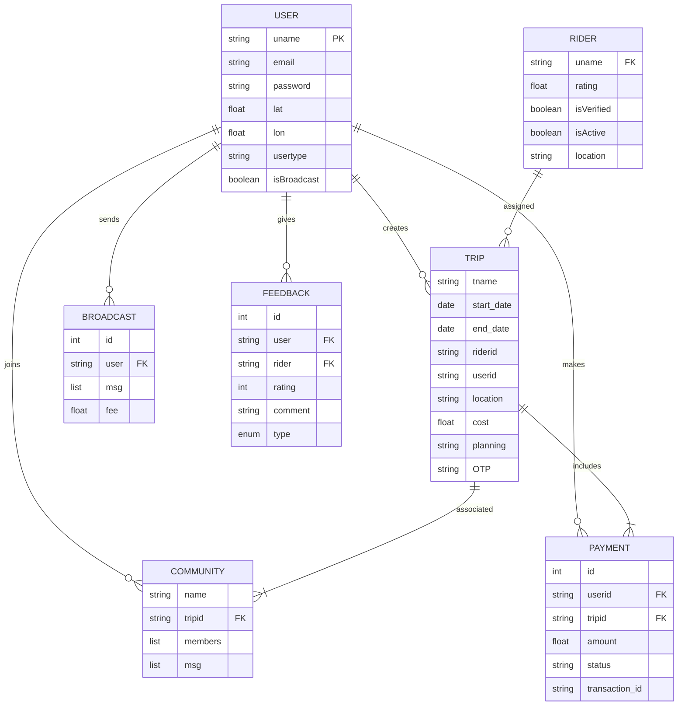
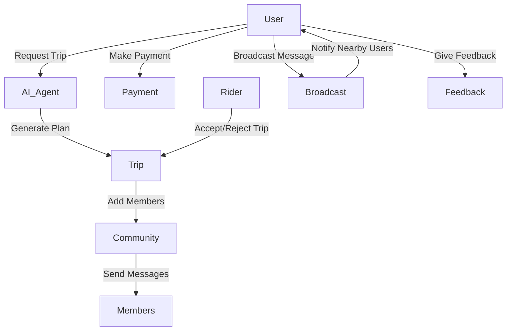
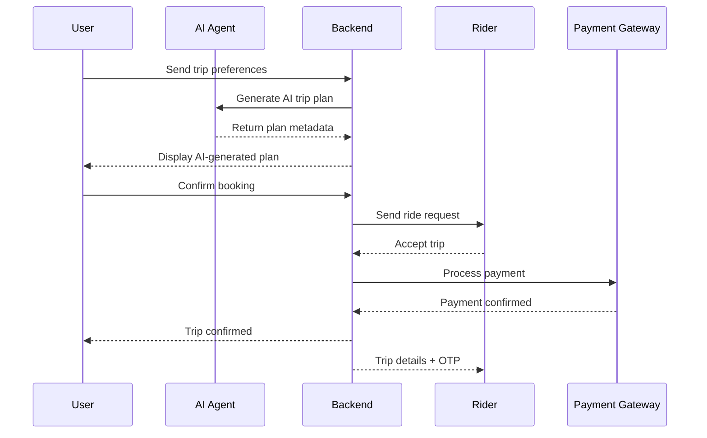
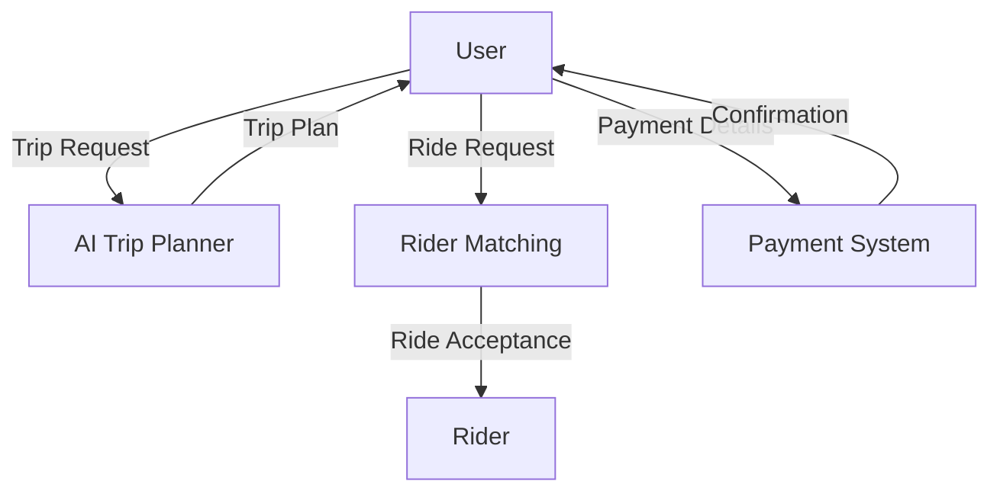
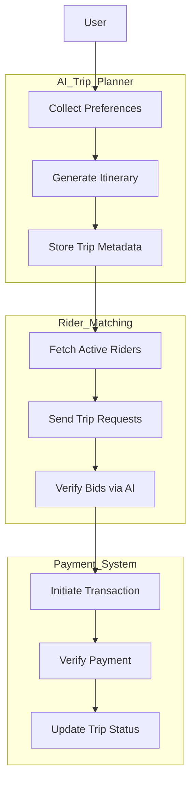
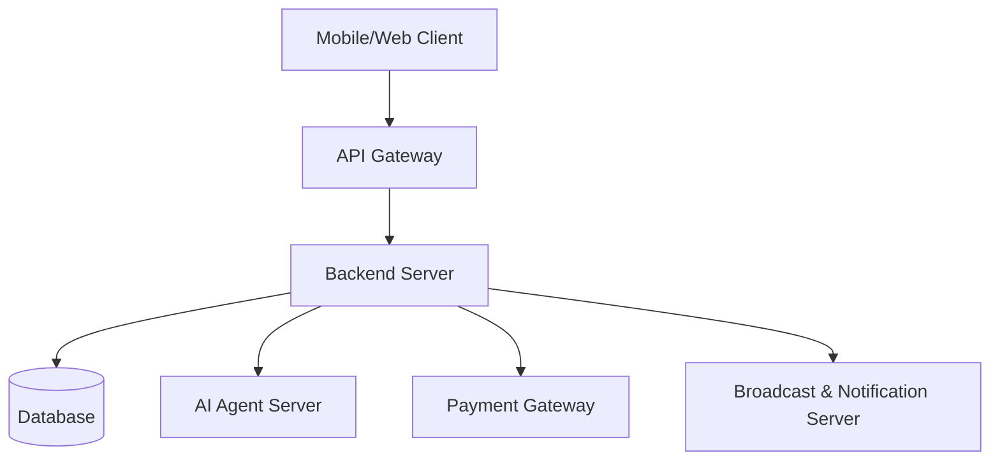

---

## 🧠 Entity Relationship Diagram (ERD)

---

## 🧩 Use Case Diagram

---

## ⏱️ Sequence Diagram – Trip Booking Flow

---

## ⚙️ Level 0 DFD (Data Flow Diagram)

---

## ⚙️ Level 1 DFD (Expanded)

---

## 🧱 Deployment Diagram

